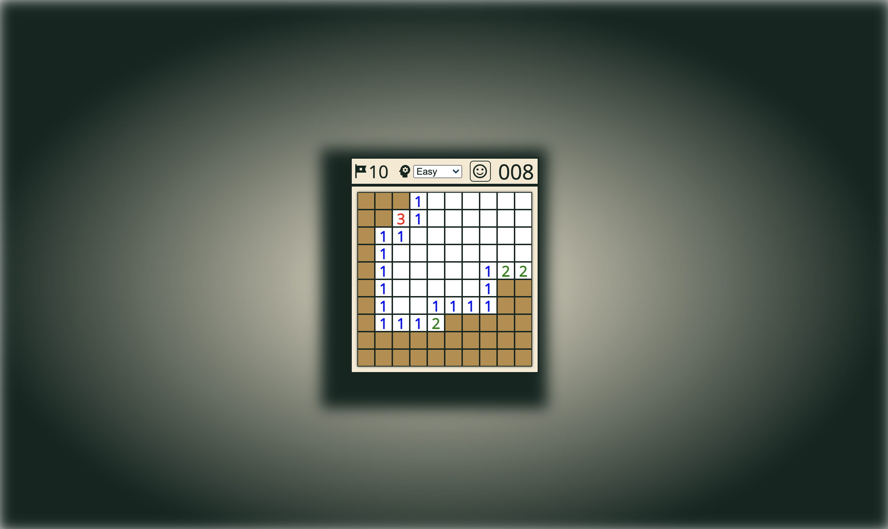

# Minesweeper

## Overview
*Minesweeper* is a single-player game which the objective is to clear a rectangular grid of cells by avoiding cells with mines and revealing all empty cells. Any empty cell can show a number indicating the quantity of mines surrounding it. It is with these numbers that the player can use logic to deduce the locations of the mines. The game ends when either the player reveals a mine or has cleared all non-mine cells.

## How To Play